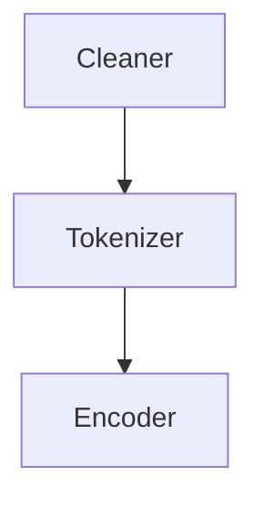
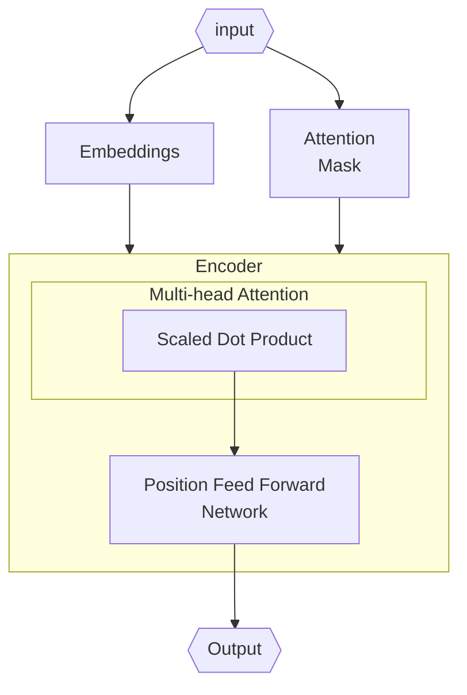

- BART = "Bidirectional and Auto-Regressive Transformer"

# References

1. https://www.geeksforgeeks.org/bart-model-for-text-auto-completion-in-nlp/
2. https://www.kaggle.com/code/yashsrivastava51213/bart-pretraining-from-scratch
3. https://www.analyticsvidhya.com/blog/2021/09/an-explanatory-guide-to-bert-tokenizer/
4. https://nlp.seas.harvard.edu/2018/04/03/attention.html
5. https://neptune.ai/blog/how-to-code-bert-using-pytorch-tutorial
6. https://jalammar.github.io/illustrated-transformer/

 [^bert]: Devlin, Jacob, Ming-Wei Chang, Kenton Lee, and Kristina Toutanova. “BERT: Pre-Training of Deep Bidirectional Transformers for Language Understanding.” arXiv, May 24, 2019. [https://doi.org/10.48550/arXiv.1810.04805](https://doi.org/10.48550/arXiv.1810.04805).
[^2]: https://www.geeksforgeeks.org/bart-model-for-text-auto-completion-in-nlp/
[^3]: https://jalammar.github.io/illustrated-transformer/
[^annotated]: https://nlp.seas.harvard.edu/2018/04/03/attention.html
# BART as De-noising Auto-encoder
---
## 1. Denoising Auto-encoder [^2]

- **Auto-encoder:** a neural network consisting of two components 
	- Encoder: to encode input sequences into lower dimensional representation
	- Decoder: to decode an embedding back to original input sequences
- **Denoising**: to randomly mask real tokens with `<MASK>` tokens, the input sequences are noised or corrupted. The denoising task makes model learning to recover the clean sequences with correct original tokens.
## 2. BART architecture

### 2.1. Comparison

- Design-wise, BART uses [[BERT]]'s bi-directional (both left & right context) encoder and [[GPT-1]]'s auto-regressive decoder.
- Parameter-wise:
	1. **BART** (140 M params): TODO
	2. [[BERT]] (110 M params): TODO
	3. GPT-1 (117 M params): TODO

### 2.2. Pre-processing
`````col
````col-md
flexGrow=5
===
1. <u>Cleaner</u>: lower-case conversion, special characters filtering, vocabulary building, zero padding.
1. <u>Tokenizer</u>: to break long sequence into tokens sequence including special characters such as `[CLS]`, `[SEP]`, `[END]`, `[PAD]`, `[MASK]`.
	- The Tokenizer handles 3 embedding sequences from every input sequence: Token embedding, Segment embedding, and Positional embedding.
	- Token embedding: `the cat is walking` --> `[5,7,9,10]`
	- Segm. embedding: 
		`the cat is walking. the dog is barking`
		--> `[5,7,9,10,[SEP],5,6,9,11]`
		--> `[0,0,0,0,1,1,1,1]`
	- Pos. embedding: 
````
````col-md
flexGrow=1
===

````
`````

There are<u> 3 primary blocks</u> [^1]
1. Multi-head attention
	- Multi-thread masking: entire mode/bi-gram mode/arbitrary mode
1. Addition and Norm
	 - Diverse ranges between blocks -> same scale conversion
	 - Monotonic function is used (x->inf, then y->constant k)
1. Feed-forward layers

.png) 
*Fig.1. BART single encoder-decoder network architecture*

### 2.3. BERT Encoder
`````col
````col-md
flexGrow=2
===
This component encodes raw text sequences into embedding containing clean, masked, and compressed information re. original input (Devlin et al., 2019)[^1].

![[bert-input.png]]
**Fig.** *BERT input representation. The input embeddings are the sum of the token embeddings, the segmentation embeddings and the position embeddings.* 

BERT's key components include:
1. Embedding layers
2. Attention mask
3. Encoder layer
	- Multi-head (MH) attention
		- Scaled dot product attention
	- Position-wise FFN

````
````col-md
flexGrow=1
===

````
`````

#### Training overview

BERT encoder has been used in several NLP tasks and depends on specific task that the mechanism would change to adapt to different objectives.
- <u><strong>Task #1:</strong></u> **Masked LM**
  Also referred as `Cloze` task; the goal is to predict randomly masked tokens for bidirectional representation learning.
- <u><strong>Task #2:</strong></u> **Next Sentence Prediction** 
  The goal is to output a binary classification of whether a pair of sequences are consecutive or not. NSP is important for sentences relationship understanding-based downstream tasks such as Question Answering and Natural Language Inference.
	1. Fetch two sequences and label of consecutive sentences or not (True/False)
	2. Token, segment, and position embedding are calculated, summed, and normalized.
	3. 
#### Embedding layers

```python
class BERTEmbedding():
	def __init__(self, vocab_size, n_segs, max_len, embed_dim, dropout):
		self.tok_embed = nn.Embedding(vocab_size, embed_dim)
		self.seg_embed = nn.Embedding(n_segs, embed_dim)
		self.pos_embed = nn.Embedding(max_len, embed_dim)

		self.drop = nn.Dropout(dropout)
		self.pos_inp = torch.tensor([i for i in range(max_len)],)
		
	def forward(self, seq, seg):
		embed_val = self.tok_embed(seq) + \
				self.seg_emb(seg) + \
				self.pos_embed(self.pos_inp)
				
		return embed_val
```

#### Attention

`````col
````col-md
flexGrow=1
===

Fig. Scaled dot-product


Fig. Multi-head attention
````
````col-md
flexGrow=3
===
There are two most commonly used attention functions: additive and dot-product.
- Scaled dot-product attention added scaling factor of $\frac{1}{\sqrt{d_k}}$
- Dot-product attention is faster and more space-efficient than additive attention.
- Soft-max applied to n-dim input will rescale them so elements of n-dim output lie in range [0,1] and sum to 1.

$$
\begin{align}
Attention(Q,K,V) &= softmax(\frac{QK^T}{\sqrt{d_k}})V\\
&\quad\text{with } Q,K \in\mathbb{R}^{d_k}, V \in\mathbb{R}^{d_v}
\end{align}
$$

The attention score computation is a 6-step process:
1. $Q=W_Q \cdot x_i \in \mathbb{R}^{d_k}$ , same with $K$--$W_K$ and $V$--$W_V$ pairs. $d_k$'s dimension is much smaller than $x_i$'s for constant computation cost.
2. Next, an 1D attention score is calculated for every input token $x_i$ from $q_i$, $k_i$ , $v_i$ by $Q\cdot K^T$. In practice, $X\in\mathbb{R}^{B\times C}$ is used. So $Q, K\in\mathbb{R}^{B\times d_k}$ and $V\in\mathbb{R}^{B\times d_v}$. Hence, the score $Q\cdot K^T\in\mathbb{R}^{B\times B}$
3. The score $Q\times K^T\in\mathbb{R}^{B\times B}$ is re-scaled by $\sqrt{d_k}$ to 
	- Without the re-scaling, as $d_k$ is getting bigger, the dot products $Q\cdot K^T$ will also grow large in magnitude and pushing softmax into regions with extremely small gradients.
	> Dot product $Q\cdot K^T$ gets large because $Q$ and $K$ are unit vectors $\in\mathcal{N}(0, 1)$, which leads to the (dot) product $\in\mathcal{N}(0,d_k)$

```python
def attention(query, key, value, mask=None, dropout=None):
    "Compute 'Scaled Dot Product Attention'"
    d_k = query.size(-1)
    scores = torch.matmul(query, key.transpose(-2, -1)) \
             / math.sqrt(d_k)
    if mask is not None:
        scores = scores.masked_fill(mask == 0, -1e9)
    p_attn = F.softmax(scores, dim = -1)
    if dropout is not None:
        p_attn = dropout(p_attn)
    return torch.matmul(p_attn, value), p_attn
```
````
`````


4. The score $\frac{Q\cdot K^T}{\sqrt{d_k}} \in \mathbb{R}^{B\times B}$ is passed through softmax to re-scale into positives in [0, 1] range and add up to 1. The score at element $(i,j)$ of this $\mathbb{R}^{B\times B}$ could be interpreted as the importance of token i-th a  
5. 


**Fig.5.** *Example of how Q, K, V are computed [^3]*
